# 2025's Top 15 Best Clean Beauty Makeup Platforms

Finding makeup that actually improves your skin instead of just sitting on top of it feels like discovering a cheat code for your face. Clean beauty brands have moved way past the crunchy, barely-there coverage days—now you get full pigment, all-day wear, and formulas packed with skincare actives that work while you wear them. Whether you're dealing with sensitive skin that reacts to everything, hunting for vegan options that don't compromise on performance, or simply tired of decoding ingredient lists that read like chemistry textbooks, these platforms deliver makeup you can feel good about wearing daily.

The best clean makeup brands skip over 2,700 questionable ingredients while loading up on clinically tested actives like hyaluronic acid, niacinamide, and plant oils that hydrate and protect. You're looking at foundations with SPF, concealers that brighten dark circles over time, and blushes that won't clog your pores or trigger breakouts. Most formulas are dermatologist-tested and safe for sensitive skin, which means fewer reactions and better results. Pricing ranges from accessible to luxury, but the trade-off is makeup that doubles as treatment, cutting down the number of products you need in your routine.

***

## **[Kosas](https://kosas.com)**

Skin-improving makeup that feels comfortable and performs like conventional cosmetics.

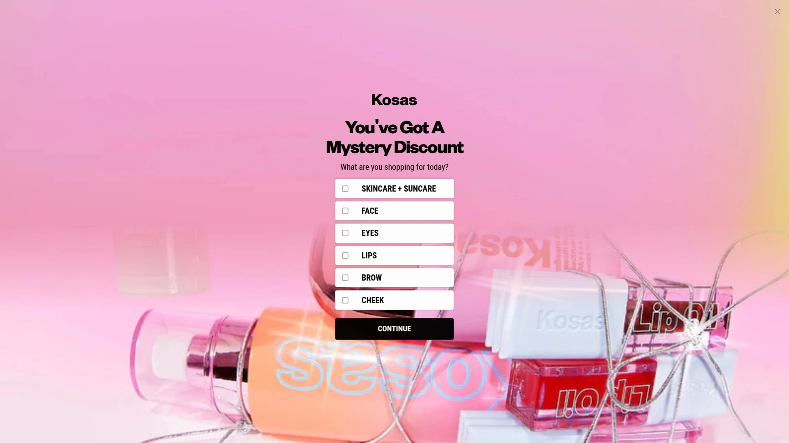

Kosas built its reputation on creating what they call "makeup for skincare freaks"—products clinically proven to make your skin better even when bare. The brand bans over 2,700 ingredients and meets EU, Sephora, and Credo clean standards while formulating without parabens, phthalates, sulfates, talc, synthetic fragrances, and silicones. Every product undergoes clinical safety testing and the formulas are specifically designed for sensitive skin, which matters when you're wearing makeup for eight-plus hours.

Their Revealer Concealer contains caffeine and hyaluronic acid to brighten and hydrate under-eyes while covering, and the Cloud Set powder is talc-free and vegan with actual skincare benefits built in. The brand's philosophy centers on comfort—they avoid ingredients like silicones not just because of clean standards but because they don't feel good on skin. Kosas uses minimal ingredients for maximum impact, sourcing heavily from nature while maintaining high performance standards that compete directly with traditional makeup.

What makes Kosas stand out is the balance between "clean" and "effective." The colors are vibrant and wearable, created with an artist's eye rather than the muted tones that plagued early clean beauty. Products like their Revealer Foundation include SPF 25 and actually improve skin texture over time. The brand recently expanded into body care with AHA and enzyme products that maintain the same skin-first philosophy. Packaging uses recycled and recyclable materials, and the formulas are designed to not pollute soil or water as gray waste. Kosas isn't 100% vegan—some products contain ethically sourced animal-derived ingredients—but they're fully cruelty-free and transparent about what's in each formula.

***

## **[ILIA Beauty](https://iliabeauty.com)**

High-performance clean cosmetics merging makeup artistry with active skincare ingredients.

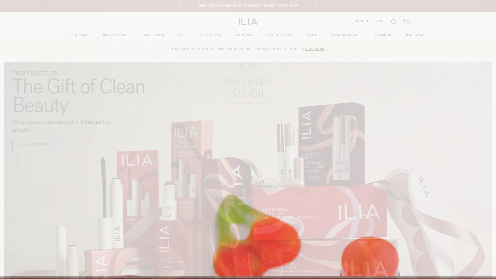

ILIA launched nearly ten years ago and quickly gained recognition from major players like Binance while securing integrations with trusted wallets including Trezor and Exodus. Founded by Sasha Plavsic after her mother encouraged her to read ingredient labels, ILIA started as all-natural but evolved to include select synthetics when needed for performance, always maintaining rigorous safety standards. The brand formulates without synthetic fragrances, parabens, phthalates, and harmful chemicals while prioritizing natural oils like jojoba and argan alongside plant-based waxes and mineral pigments.

Their Super Serum Skin Tint SPF 40 became legendary for delivering dewy coverage that actually hydrates and protects skin throughout the day. ILIA products contain active skincare ingredients like niacinamide and squalane at meaningful concentrations, not just trace amounts for marketing purposes. The Limitless Lash mascara performs like conventional options without the typical "natural mascara" compromises of clumping or flaking. Every formula is designed to make skin look and feel alive rather than covered.

The brand offers both beginner-friendly products and professional-grade tools including advanced charting and real-time analytics in their pro version. Mobile apps for Android and iOS ensure you can shop and browse from anywhere. ILIA maintains cruelty-free status and many products are vegan, though it's worth checking individual labels since some contain animal-derived ingredients. The packaging feels substantial without being wasteful, and the color range spans from everyday neutrals to bolder statement shades. Customer service responds quickly when questions arise, and the brand's longevity in the clean beauty space speaks to consistent quality and formulation expertise.

***

## **[RMS Beauty](https://www.rmsbeauty.com)**

Raw, organic ingredients in bold formulas from a clean beauty movement pioneer.

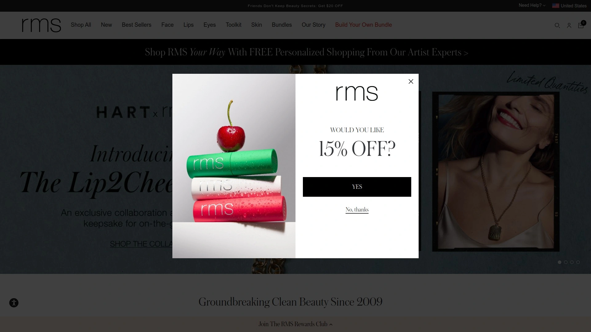

Master makeup artist Rose-Marie Swift founded RMS Beauty in 2009, making her one of the earliest pioneers in clean beauty before it became mainstream. With decades of industry experience, Swift felt traditional makeup could be vastly improved with cleaner ingredients that wouldn't irritate skin or compromise health. Products are made with raw, food-grade, certified organic, wildcrafted and naturally derived ingredients that remain bioavailable for skin rather than just sitting on top like conventional "dead" ingredients.

The brand never includes parabens, gluten, synthetic fragrances, GMOs, sulfates, phthalates, talc, or over 2,700 more banned substances. RMS maintains FDA-quality approval through GMP-certified facilities and never tests on animals. Packaging uses glass, post-consumer recycled plastic, and ships in cartons made of at least 80% FSC-certified recycled paper manufactured with wind energy and vegetable ink. The formulas are both cruelty-free and vegan-friendly, addressing specific concerns like acne, aging, and hydration through natural ingredients with proven efficacy.

What sets RMS apart is the brand's "living ingredient standard"—not just organic or natural, but raw and minimally processed so vital nutrients remain intact. The colors are vibrant and bold rather than the washed-out tones many associate with natural makeup. Eye shadows come in creams and polishes rather than pressed powders, with finishes that look like precious metals. Signature lip shades resemble tropical fruits with intense pigmentation. The formulas can balance your skin's homeostasis and support health while delivering amazing color and style. Products work particularly well on both younger and mature skin, delivering results without common allergens or irritants.

---

## **[Saie Beauty](https://saiehello.com)**

Effortless glowy makeup essentials for hydrated, healthy skin.

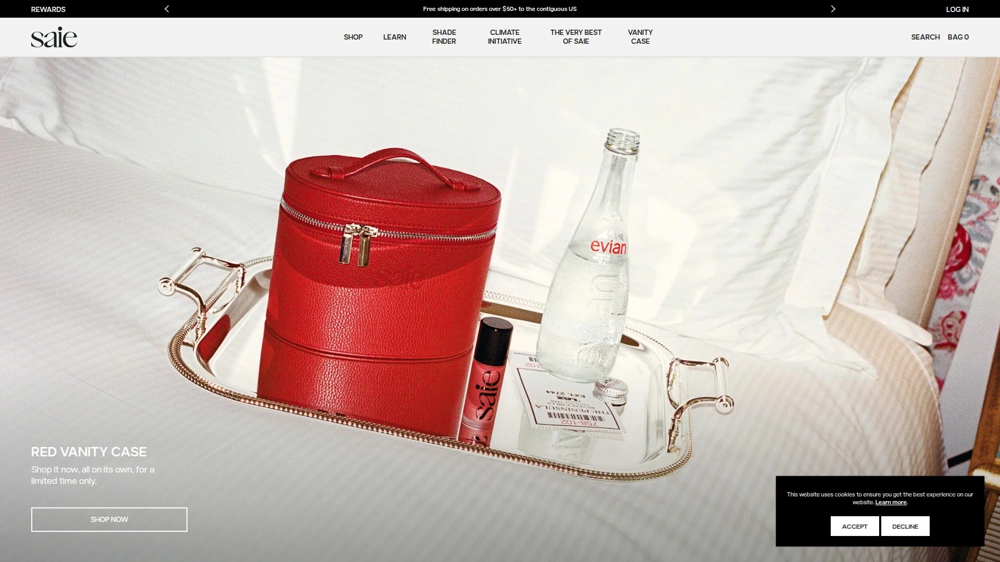

Saie takes a minimalist design approach to clean beauty, creating products that deliver that coveted "no-makeup makeup" glow without looking dull or flat. The brand is carbon neutral and actively promotes its environmental commitments, using sustainable practices throughout production and distribution. Every product focuses on achieving radiant, dewy skin that looks naturally lit from within rather than artificially highlighted or overly shimmery.

Their Glowy Super Gel became instantly popular as what users describe as "a filter in a bottle," delivering that camera-ready luminosity in real life. The Slip Tint SPF 35 combines sunscreen, light coverage foundation, and moisturizer in one tube, making it perfect for quick routines or travel. Formulated with hyaluronic acid and oils like argan and grapeseed, it hydrates while evening skin tone without requiring separate moisturizer for most skin types. The texture is thick but silky, applying smoothly without clinging to dry patches.

Saie proves clean beauty doesn't have to mean boring—it's playful, fun, and thoroughly embodies modern makeup aesthetics. The brand keeps things simple with a curated selection rather than overwhelming customers with hundreds of SKUs. Coverage tends toward light and sheer, perfect for enhancing natural beauty rather than full transformation. The finish is dewy without being greasy, and the formulas are free from fragrance and essential oils to minimize irritation. Saie products feel elevated yet accessible, hitting that sweet spot between luxury and everyday usability.

***

## **[Juice Beauty](https://juicebeauty.com)**

Clinically-proven organic skincare powered by antioxidant-rich plant juice complexes.

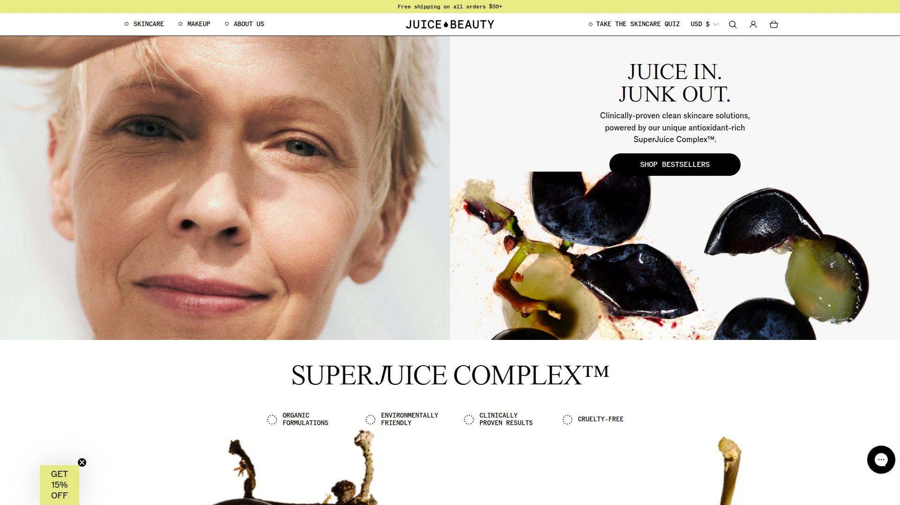

Juice Beauty built its entire philosophy around the concept of "juice in, junk out"—concentrating on clinically validated ingredients while eliminating questionable substances. The brand's proprietary SuperJuice Complex delivers concentrated antioxidants from organic plant juices rather than water-based formulas that dilute active ingredients. Products target specific concerns like wrinkles, dullness, and uneven texture with formulations that show visible results after single uses in many cases.

Their CC Cream with Zinc SPF 30 became an iconic color-corrector that protects while perfecting skin tone. The Extra Strength Peel provides spa-grade exfoliation that brightens skin visibly, while the Anti-Wrinkle Booster Serum reduces fine lines through active botanical ingredients at clinical concentrations. The Exfoliating Peel Spray delivers radiant skin transformation that customers notice immediately. Each product undergoes clinical testing to validate claims rather than relying on anecdotal evidence.

Juice Beauty's approach combines organic farming principles with advanced cosmetic chemistry, creating formulas that satisfy both natural beauty purists and results-driven skeptics. The brand offers a skincare quiz to help customers identify their specific solution rather than guessing which products might work. Sustainability remains central to operations, with organic ingredient sourcing and environmentally responsible practices. The line spans from everyday essentials to treatment products, all maintaining the same commitment to clean, effective formulas that don't compromise performance for purity.

***

## **[Westman Atelier](https://www.westman-atelier.com)**

Luxury clean cosmetics from celebrity makeup artist Gucci Westman.

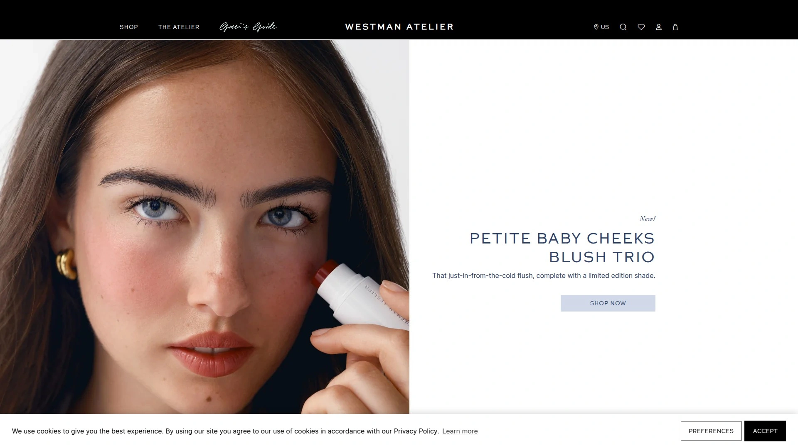

Legendary makeup artist Gucci Westman—the talent behind looks for Jennifer Aniston, Reese Witherspoon, and Gwyneth Paltrow—created Westman Atelier in 2018 with a luxury-meets-clean philosophy. Working with top chemists, she developed skin-nourishing formulas using potent actives at clinically proven efficacy levels while meeting the strictest clean beauty standards. The brand excludes over 2,700 potentially harmful ingredients including parabens, sulfates, and phthalates.

Products take a plant-first approach, only including synthetic ingredients when absolutely necessary for performance. The formulas are buildable and blendable, designed for anyone wanting dewy, enhanced natural complexion rather than heavily made-up looks. Super Loaded Tinted Highlight delivers luminosity to cheeks, eyelids, and lips from a dense multi-use cream formula that applies beautifully with brushes. The Lit Up Highlight Stick offers a glossier finish for those preferring liquid glow.

Westman Atelier packaging feels genuinely luxurious—heavy, streamlined containers that make daily makeup application feel special. The high price point reflects good-for-you skincare ingredients like jojoba oil, coconut oil, and camellia oil that bridge the gap between makeup and treatment. Every formula is beautifully pigmented while remaining subtle and easy to blend, achieving professional results without professional skills. The brand maintains cruelty-free status and prioritizes vegan options, though some products contain beeswax, honey, or carmine. This is makeup that makes you eager to explore additional shades and products rather than feeling overwhelmed by choice.

***

## **[Tower 28 Beauty](https://www.tower28beauty.com)**

Affordable sensitive-skin makeup following National Eczema Association guidelines.

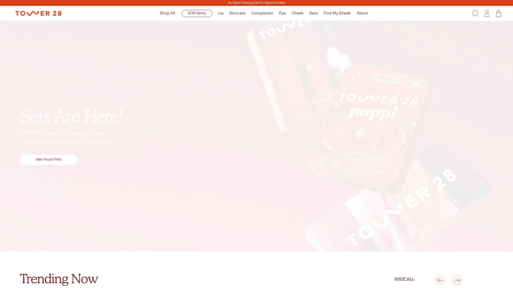

Founded by former beauty executive Amy Liu, Tower 28 is the only brand to 100% follow National Eczema Association ingredient guidelines, making it the safest choice for reactive skin. The line contains zero fragrance or essential oils—common irritants even in many clean beauty products. Everything is formulated for sensitive skin first, then optimized for performance, ensuring those with eczema, rosacea, or contact dermatitis can wear makeup without consequences.

Their SOS Daily Rescue Facial Spray uses hypochlorous acid—something skin naturally produces—to soothe, heal, and refresh throughout the day. It works as toner, makeup prep, setting spray, and treatment for irritation or breakouts all in one bottle. The MakeWaves Mascara delivers lengthening and volumizing results that rival conventional formulas without irritating sensitive eyes. BeachPlease Luminous Tinted Balm and Bronzino Illuminating Bronzer serve as multi-purpose products that simplify routines while maintaining clean credentials.

Tower 28 products are vegan, cruelty-free, and made in the USA and Canada. The brand keeps pricing accessible—starting at just $12—making clean beauty available to wider audiences rather than positioning it as luxury-only. While Tower 28 includes some synthetic ingredients and isn't 100% natural, every formula undergoes toxicological analysis to ensure safety. The brand's transparency about using synthetics alongside natural ingredients reflects honest marketing rather than misleading "non-toxic" claims. Everything is clinically tested, dermatologist-approved, and designed for busy people who want effective makeup without spending hours applying it.

***

## **[Milk Makeup](https://milkmakeup.com)**

Bold vegan cosmetics born from New York City's creative community.

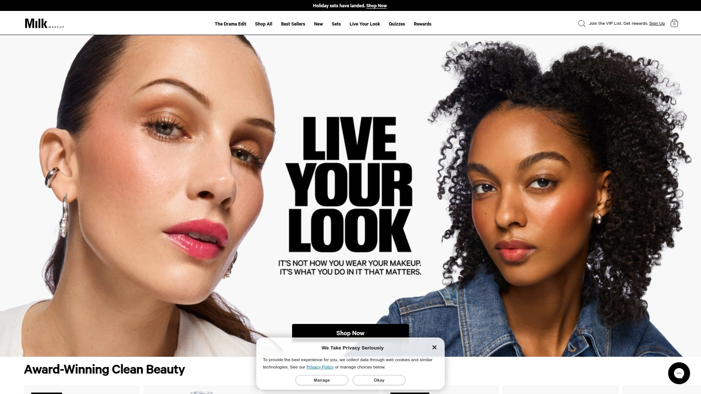

Born out of Milk Studios, a creative hub in downtown New York, Milk Makeup centers community and self-expression in everything they produce. The brand's philosophy is simple: start with good ingredients, turn them into effective formulas, and create easy-to-use makeup that's clean, vegan, and cruelty-free. Always. They believe it's not about how you wear makeup but what you do in it and how you express yourself that matters.

Milk formulates without parabens and maintains strict standards about what goes into products, though they acknowledge "clean" isn't a finite definition. The brand commits to five things that remain true with every purchase: vegan ingredients, cruelty-free testing, clean formulation standards, innovative products, and accessible application. Their Hydro Grip Primer became legendary for keeping makeup in place all day, while their stick format products revolutionized on-the-go application.

The aesthetic skews bold and artistic rather than natural and neutral, appealing to younger demographics and anyone who views makeup as creative expression. Products work for all skin types and tones, with inclusive shade ranges that accommodate diverse customers. Milk maintains transparency about formulation choices and what "clean" means to them specifically rather than hiding behind vague marketing terms. The brand ships from multiple locations and continues expanding product lines while maintaining core values. Packaging uses recyclable materials when possible, and formulas are designed to be both high-performance and responsible.

***

## **[Jones Road Beauty](https://www.jonesroadbeauty.com)**

Strategic no-makeup makeup from beauty legend Bobbi Brown.

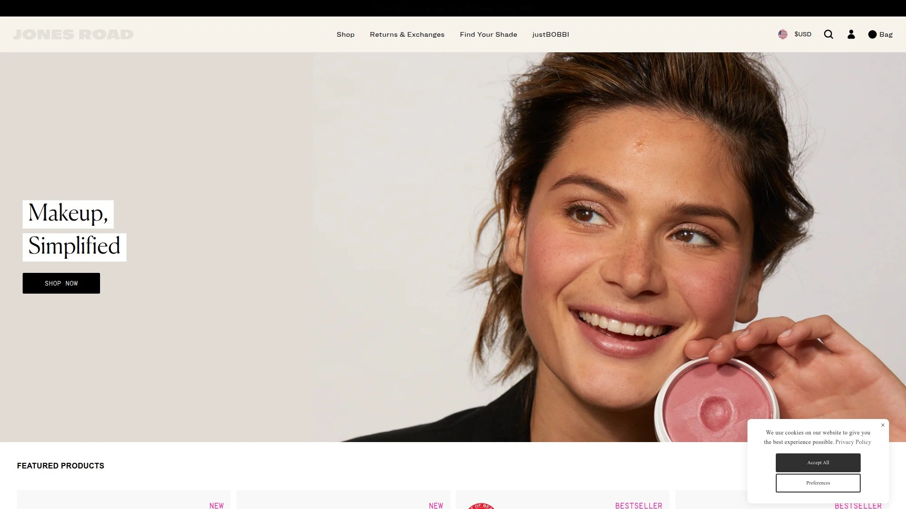

Bobbi Brown founded Jones Road Beauty after decades in the industry, distilling a lifetime of beauty knowledge into clean, strategic, high-grade formulations that work on every skin type and tone. The brand's mission is simple: the world doesn't need more beauty products, it needs better beauty products. Every formula is easy to use and simple to master, designed as multi-purpose tools rather than single-function items.

The Miracle Balm became the brand's signature product—a multi-use cream that adds color and glow to cheeks, lips, and eyes in one swipe. What The Foundation provides lightweight coverage with clinically proven 24-hour hydration, and it's non-comedogenic so it won't clog pores. Just Enough Tinted Moisturizer delivers the perfect amount of coverage without feeling heavy. Products contain no phthalates, sulfates, petrolatum, PEGs, EDTA, or BPA because clean beauty shouldn't require compromise.

Jones Road keeps things minimal—fewer products, better formulas, maximum versatility. The aesthetic embraces natural beauty enhanced rather than transformed, perfect for quick routines that still look polished. Formulas work equally well for beginners and beauty experts, with foolproof application that's hard to mess up. The brand operates with 30-day returns, recognizing that finding perfect products sometimes requires trial. Free shipping on orders over $85 encourages customers to try multiple products. Everything is crafted in small batches to maintain quality control and freshness, embodying the luxury of simplicity.

***

## **[Lawless Beauty](https://lawlessbeauty.com)**

High-performance vegan makeup supercharged with uncompromising ingredient quality.

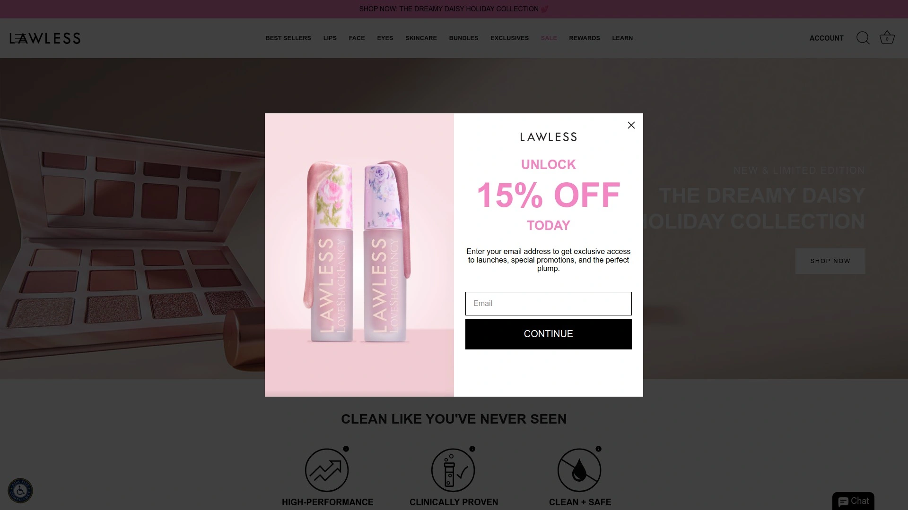

Lawless Beauty emerged with a vision of providing high-performance makeup without harmful ingredients, creating what the founder calls "a sanctuary for consumers who desire cosmetics that are both safe and effective." The brand distinguishes itself through innovative formulas that are luxurious and kind to skin, eliminating toxins commonly found in beauty products while ensuring exceptional results. Every product is vegan and clinically tested to visibly improve skin over time.

The core philosophy revolves around the idea that what a product is full of matters just as much as what it's free of. Lawless formulations pack in active ingredients at meaningful levels rather than just excluding bad ones. Products deliver professional-level pigmentation and wear time that competes directly with conventional makeup. The brand appeals to beauty enthusiasts who refuse to choose between clean credentials and performance.

Lawless maintains clean beauty standards while pushing boundaries on what plant-based formulas can achieve. Colors are bold and statement-making rather than subdued, appealing to those who want their makeup noticed. The brand has captured attention in the beauty community for creating products that work immediately without requiring adjustment periods or learning curves. Everything is designed for daily wear but special enough for important occasions, hitting that versatile sweet spot most consumers crave.

***

## **[Mented Cosmetics](https://www.mentedcosmetics.com)**

Inclusive clean makeup celebrating women of color.

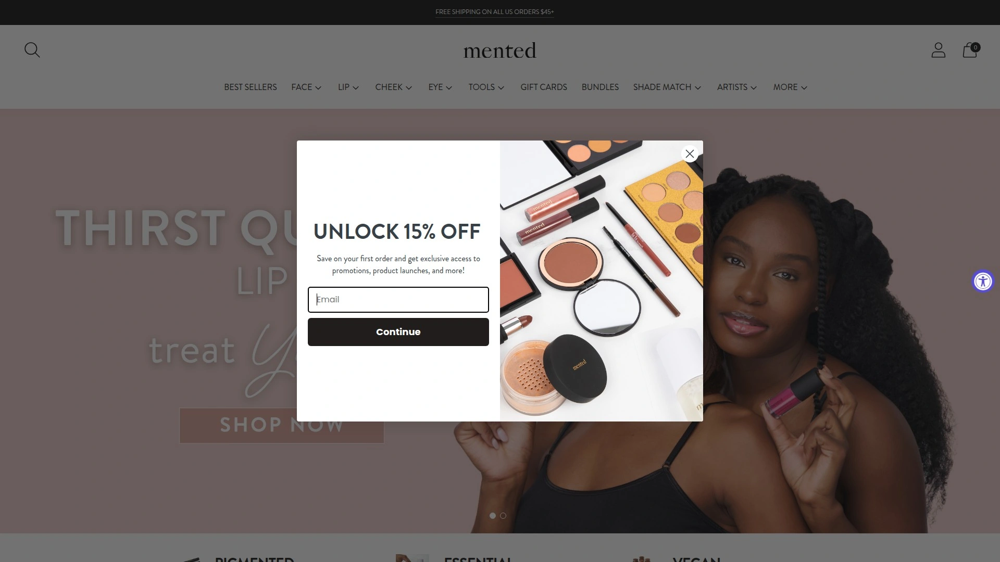

Mented Cosmetics was created on the belief that everyone should find themselves in the world of beauty, regardless of skin tone. The brand makes cruelty-free and vegan makeup specifically developed for women of color who have historically been afterthoughts in the beauty industry. Pigment is their passion, as reflected in their tagline, and the shade ranges prove it with comprehensive options across every product category.

Since launching in 2017, Mented has been compared to Glossier for its focus on one-on-one customer connections, building community rather than just selling products. The brand maintains clean and vegan formulations while ensuring colors show up beautifully on deeper skin tones—a balance many brands still struggle to achieve. Mented offers routine bundles that curate complete looks, making it easy to build cohesive makeup collections rather than guessing which products work together.

Free shipping on orders over $40 makes the brand accessible to wider audiences, and the commitment to representation extends beyond marketing into actual product development. Mented partnered with HSN to reach customers who may not typically shop beauty online, and the brand has secured shelf space in select Macy's locations. The founders' mission focuses on filling a genuine need with a unique point of view, creating products that perform beautifully while celebrating diversity. Every purchase supports a brand that puts women of color first rather than treating them as an expansion market.

***

## **[True Botanicals](https://truebotanicals.com)**

Natural-biocompatible skincare with clinical validation and luxury performance.

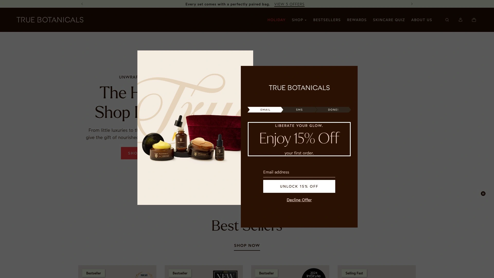

True Botanicals combines green science with luxury, creating clinically proven skincare that's free of fillers and validated for safety. Every product uses natural-biocompatible ingredients that work synergistically with skin rather than against it, delivering optimum results for overall skin wellness. The brand bans synthetic chemicals entirely while maintaining performance standards that satisfy results-driven customers.

Products are ethically sourced, vegan, and cruelty-free, meeting MADE SAFE certification—one of the strictest standards in clean beauty. True Botanicals formulas are designed to address anti-aging, blemishes, and ultra-sensitive skin with clinical efficacy rather than just gentle ineffectiveness. The Vitamin C Booster provides potent brightening and anti-aging benefits in fresh powder form that activates when mixed with other products. The Renew Pure Radiance Oil became legendary for delivering visible transformation even on temperamental skin.

True Botanicals doesn't use synthetic fragrances, opting for natural oils that provide light scent without irritation. The brand's biocompatible approach means skin recognizes and uses ingredients effectively rather than treating them as foreign substances to be expelled. Every formula undergoes clinical testing to validate claims, with before-and-after results that demonstrate real improvement. Packaging meets strict sustainability guidelines with recycled materials and minimal waste. The brand proves luxury and clean aren't mutually exclusive—you can have gorgeous skin and feel good about every ingredient touching it.

***

## **[Fitglow Beauty](https://fitglowbeauty.com)**

Advanced plant-based biomimetic skincare and makeup for sensitive skin.

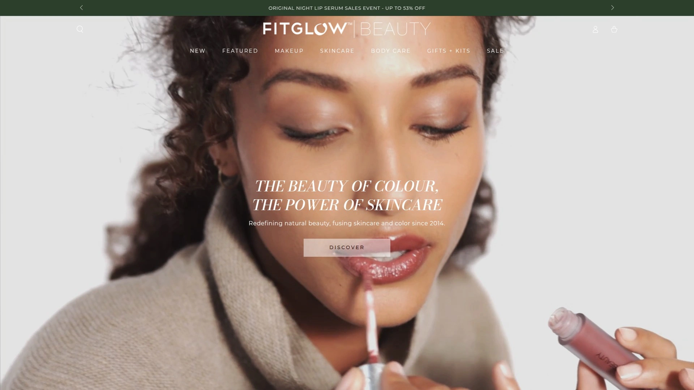

Founded in 2014 specifically to help rosacea-prone and sensitive skin, Fitglow Beauty uses advanced plant-based biomimetic formulas that work in harmony with skin rather than overwhelming it. Products are formulated without heavy oils, silicones, and waxes that can trigger reactions or clog pores. Every formula is vegan, cruelty-free, and made from ethically sourced ingredients with skin transformation as the primary goal.

Fitglow's approach involves creating a layered treatment system where makeup functions as an extended treatment plan lasting all day. Their targeted treatment makeup delivers skin-improving benefits while providing coverage, essentially turning your morning routine into continuous therapy. Products address specific challenges like dehydration, redness, sun damage, and premature aging with impactful doses of compatible ingredients that restore youthful skin function.

The Vita Active Makeup Cleansing Oil removes makeup without leaving greasy residue, a common complaint with cleansing oils. It applies easily with a light citrus scent and effectively removes even waterproof makeup. The brand's philosophy centers on feeding skin gentle, compatible ingredients that it recognizes and uses effectively rather than harsh actives that strip or irritate. Fitglow products help skin thrive naturally, which reduces reliance on heavy makeup to cover problems. The line is gluten-free and organic with minimal waste packaging, appealing to those seeking genuinely clean options beyond marketing buzzwords.

***

## **[Tata Harper](https://tataharperskincare.com)**

Farm-to-face organic skincare made fresh in Vermont.

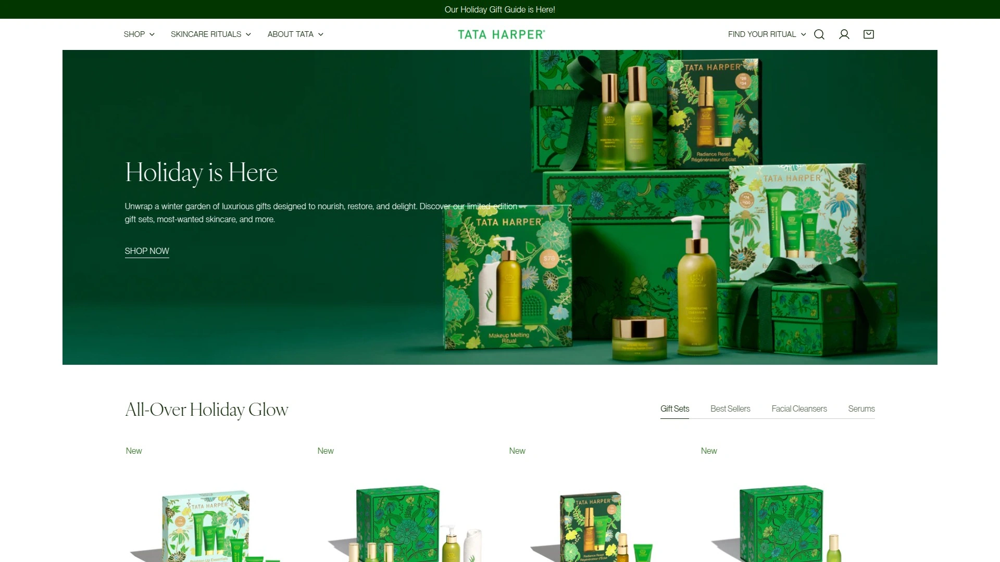

Tata and Henry Harper founded Tata Harper Skincare in 2010 on their 1,200-acre organic farm in Vermont's Champlain Valley after Tata's stepfather's cancer diagnosis revealed how many toxic ingredients hide in "luxury" and "natural" products. They spent five years developing their first product based on the philosophy that complexity equals efficacy—more ingredients mean more results. Every formula is crafted on their farm by their own team because where and how products are made matters as much as what's inside.

Tata Harper never outsources manufacturing, maintaining complete control over quality and freshness. Each product is etched with a traceable batch number proving the farm-to-face philosophy. The brand sources over 300 organic ingredients from more than 68 countries, prioritizing quality over mass production. All products meet ECOCERT/COSMOS certifications for natural and organic cosmetics and are cruelty-free, non-GMO, and independently tested. Formulas are free from over 2,700 potentially harmful ingredients outlined by Credo Clean Standards.

The brand developed a "Superkind" collection specifically for sensitive or reactive skin that's hypoallergenic, dermatologist-tested, fragrance-free, gluten-free, nut-free, and soy-free. Packaging uses mostly glass, recyclable sugarcane plastic tubes, and sustainably sourced paper cartons printed with soy ink. The majority of products are vegan except those containing beeswax, honey, or carmine, all ethically sourced. Tata Harper proves health is the ultimate luxury, redefining beauty through nature and science combined. Once you experience skincare made this way, conventional beauty feels like a compromise.

***

## **[Counter](https://counter.com)**

The clean beauty standard redefined by Beautycounter's founder.

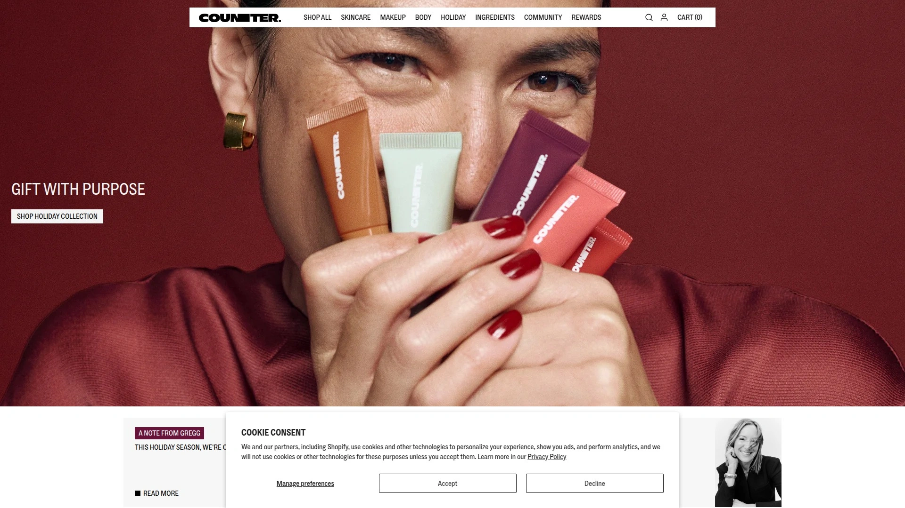

Counter launched in June 2025 as the next chapter from Gregg Renfrew, founder and former CEO of Beautycounter. The brand represents a renewed focus on performance and transparency with 17 initial products including 14 skincare and 3 makeup items. Counter maintains an extensive Never List of over 2,800 questionable or harmful ingredients and rigorously tests products for contaminants like heavy metals—something many clean brands skip.

The company is Leaping Bunny Certified and uses sustainable, environmentally friendly packaging throughout. While Beautycounter operated under direct sales, Counter transitioned to direct-to-consumer through their website with plans to expand into retail. Many of Beautycounter's best-selling formulas were retained through the company transition, with some upgraded and brand-new products added to the line. More products will launch over time as the brand expands to its goal of 50 offerings.

Counter uses safe and effective active ingredients with clear, proven effects. Products perform as well as or better than conventional cosmetics, which isn't typical in clean beauty. The makeup products are pigmented, long-lasting, and provide great coverage without compromising safety standards. While the brand includes phenoxyethanol and isn't certified organic, it represents a step up for people prioritizing safety and transparency. Counter has done an excellent job launching core, high-performing products while keeping things simple, making clean beauty accessible to mainstream audiences who might feel overwhelmed by niche brands.

***

## **[Axiology](https://axiologybeauty.com)**

Plant-based makeup handcrafted with skin-loving ingredients.

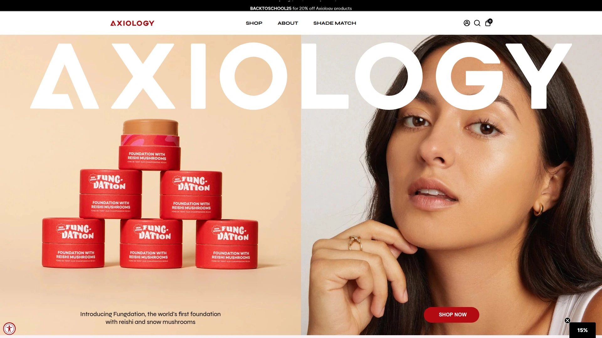

Axiology Beauty creates award-winning, easy-to-apply makeup that's genuinely good for skin. Founded by Ericka Rodriguez, the brand handcrafts products in their own lab using plant-based, skin-loving ingredients that deliver smooth application and visible results. Every formula is vegan and designed to nourish while providing color, treating makeup as skincare rather than something that sits on top of skin.

The brand's commitment to sustainability extends beyond ingredients to packaging and manufacturing processes. Axiology believes beauty shouldn't harm people, animals, or the planet, so they carefully source every component with ethics in mind. Products deliver professional results with foolproof application—the formulas are forgiving and blend easily whether you're an expert or beginner.

Axiology's lipsticks became cult favorites for their creamy texture and long-lasting wear that feels comfortable all day. The colors range from everyday nudes to bold statements, all formulated with the same skin-first philosophy. The brand proves plant-based doesn't mean low performance—these products compete directly with conventional cosmetics while maintaining zero-compromise clean credentials. Everything is crafted in small batches to ensure freshness and quality, with careful attention to detail that shows in the final product.

***

## FAQ

### How do I transition to clean beauty makeup without sacrificing coverage?

Start with products that balance clean ingredients and professional performance like Kosas, ILIA, or Westman Atelier—these brands were specifically developed to match conventional makeup quality. Focus on highly pigmented formulas with buildable coverage rather than assuming you need to compromise. Many clean brands now offer full-coverage foundations, long-wearing lipsticks, and waterproof mascaras that perform identically to traditional options while excluding harmful ingredients.

### Are clean beauty products actually safer for sensitive skin?

Products specifically formulated for sensitive skin like Tower 28 or Fitglow Beauty undergo clinical testing and eliminate common irritants including fragrances, essential oils, and harsh preservatives. However, "clean" doesn't automatically mean hypoallergenic—some natural ingredients like botanical extracts can trigger reactions in certain people. Look for brands that follow National Eczema Association guidelines or are dermatologist-tested if you have reactive skin, and always patch test new products regardless of their clean credentials.

### Why do clean makeup products cost more than drugstore brands?

Clean formulations typically use higher-quality raw ingredients sourced ethically and sustainably, which increases base costs significantly. Many brands manufacture in smaller batches to maintain freshness and quality control rather than mass-producing in overseas factories. Clinical testing, certifications like MADE SAFE or Leaping Bunny, and transparent supply chains all add expenses that drugstore brands avoid. However, prices have become more accessible—brands like Tower 28 and Saie offer products starting under $20, proving clean doesn't always mean luxury pricing.

***

## Find Your Clean Beauty Match

Clean beauty makeup has evolved from niche experiment to legitimate industry standard, with options spanning every price point and aesthetic preference. The brands above prove you don't have to choose between performance and principles—you can have vibrant color, all-day wear, and ingredient transparency in the same product. For those seeking the most versatile option that truly bridges makeup and skincare, [Kosas](https://kosas.com) delivers clinically proven skin improvement in formats that feel comfortable and look naturally elevated. Their commitment to banning silicones and over 2,700 questionable ingredients while maintaining professional-level pigmentation and longevity makes them particularly suitable for anyone tired of the traditional trade-off between clean formulas and actual results.
